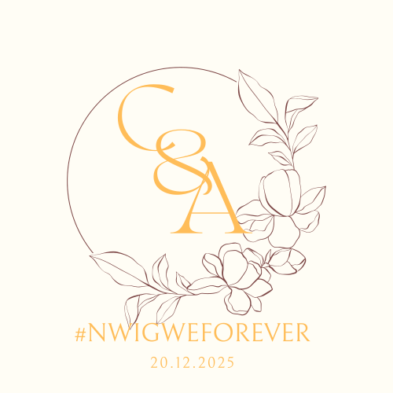
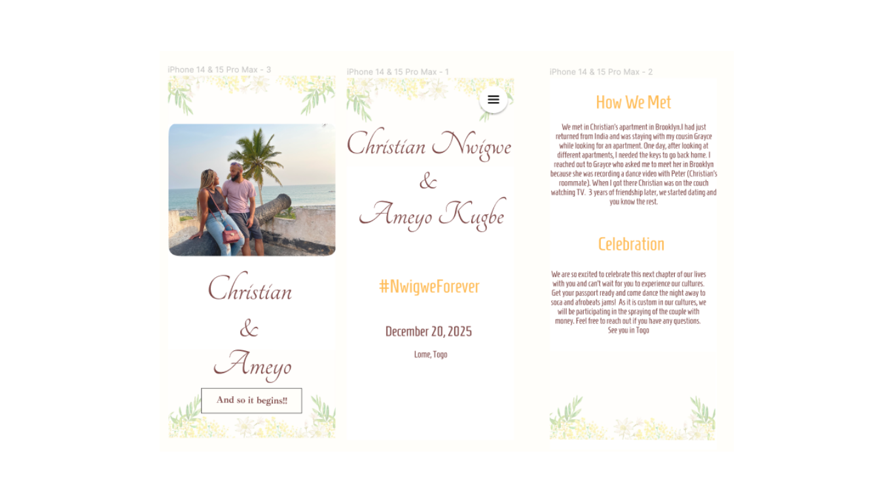
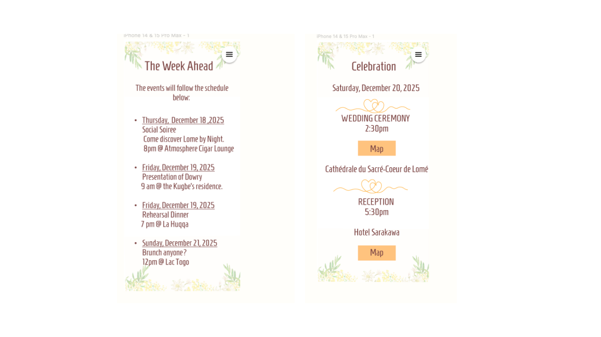
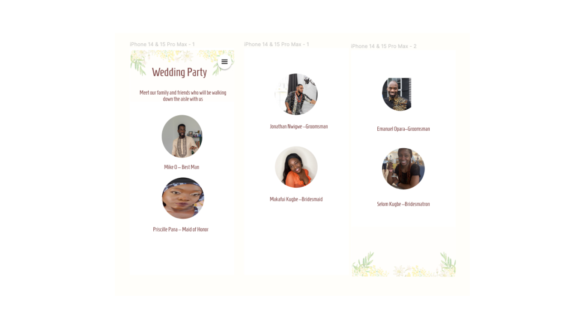
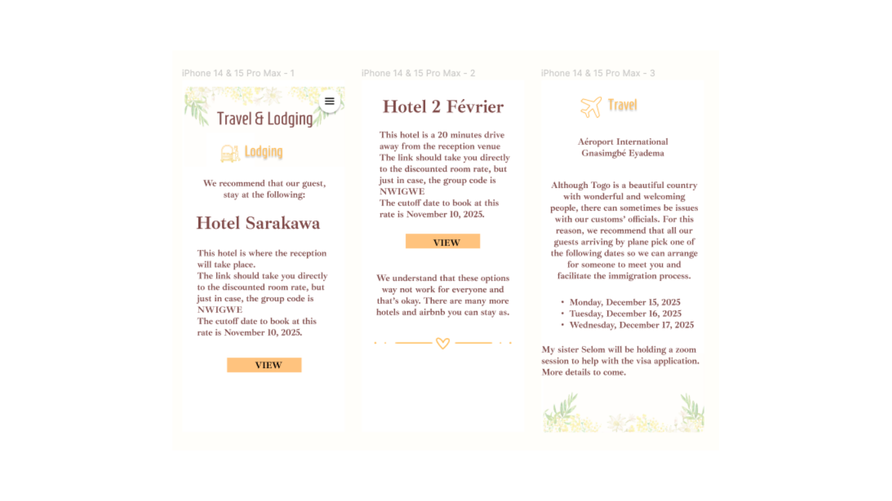
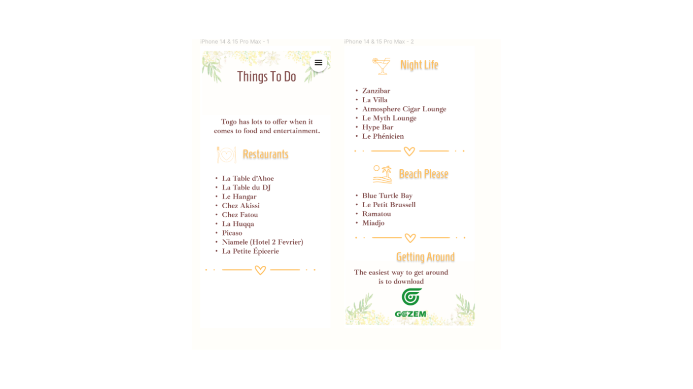
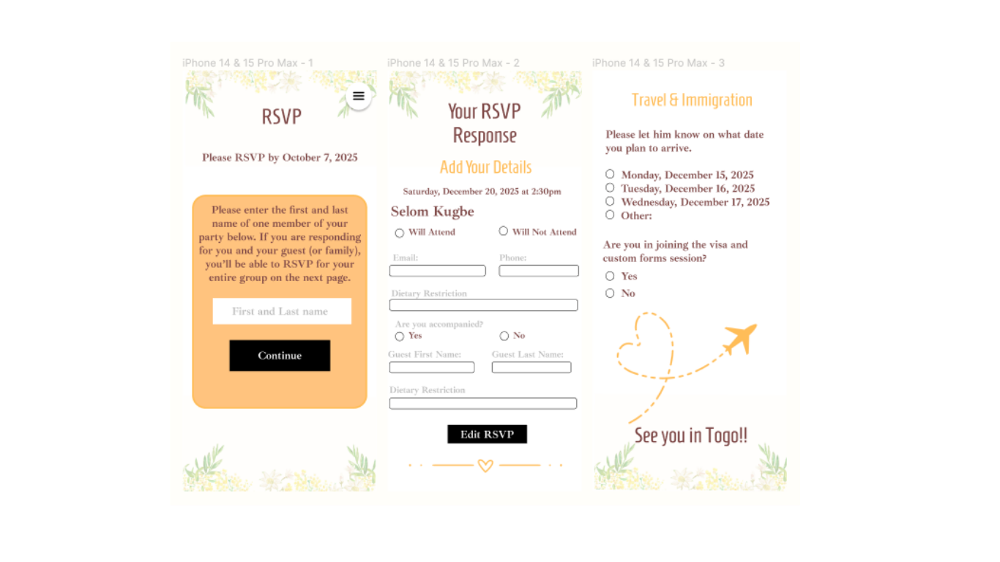

# NwigweForever

My husband and I did our court wedding in June 2022. We are excited to have are family and friends over in Togo in December 2025 to celebrate our traditional and religious wedding. We want our guests to have access to all the information they need to have a get to Togo on time and have an epic time. 

## Objectives
We want to provide a seamless experience for the guests. There will be many moving pieces and therefore, it is important we stay organize and keep all guests informed and up to date. Additionally, not all guests are invited to all events. We have to make sure that the right guests have the right information.

## Getting Started 

## Wireframe
Here is our welcome and home page

On these pages, guest will be able to see the schedule of all events. 

On this page, guests will see a brief description of the weeding party. 

On this page, guests will be able to access the lodging and travel informations. 

On this page, guests will see the lists of things they can do when they are not with us. 

On this page, guests will be to RSVP. 

## Components Diagram 
## ERD 
## Strech Goals 
* I want our photos page to be a carousel of different pictures. 
* I want guests to be able to access different types of information. 

## Technology Used
* Django 
* Sass
* Python 
* Github

## Sources 
* https://www.w3schools.com/sass/sass_intro.php
* https://www.youtube.com/watch?v=CgkZ7MvWUAA&t=4843s
* https://www.youtube.com/watch?v=_kqN4hl9bGc&list=PL4cUxeGkcC9jxJX7vojNVK-o8ubDZEcNb&index=1
* https://sass-lang.com/guide/
* https://github.com/AbeGue02/tick-it/tree/main/back-end
* https://developer.mozilla.org/en-US/docs/Web/JavaScript/Reference/Global_Objects/Array/find
* Chat GPT

